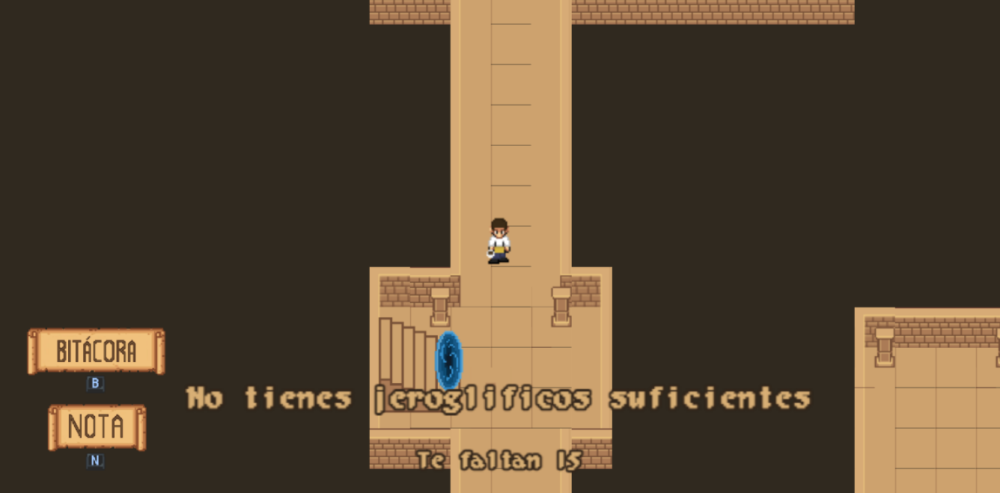
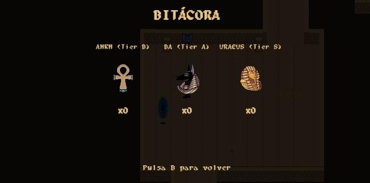
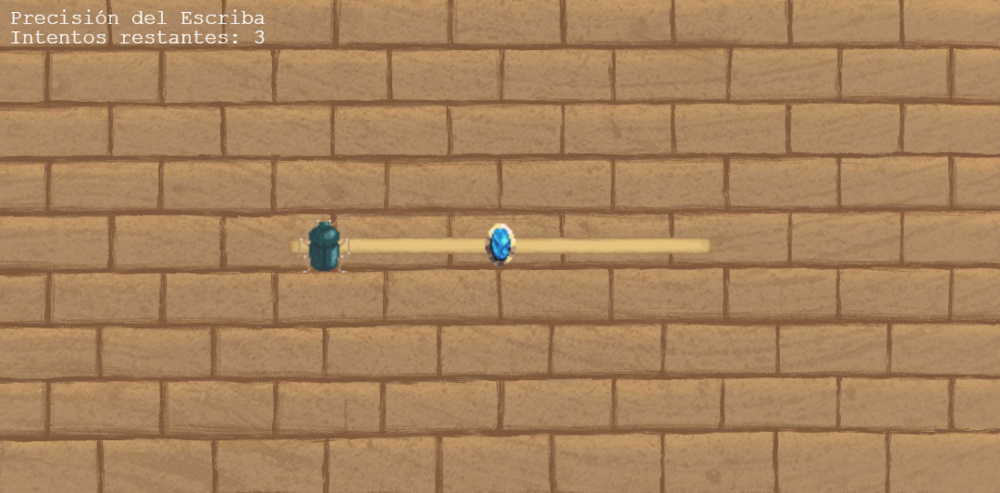
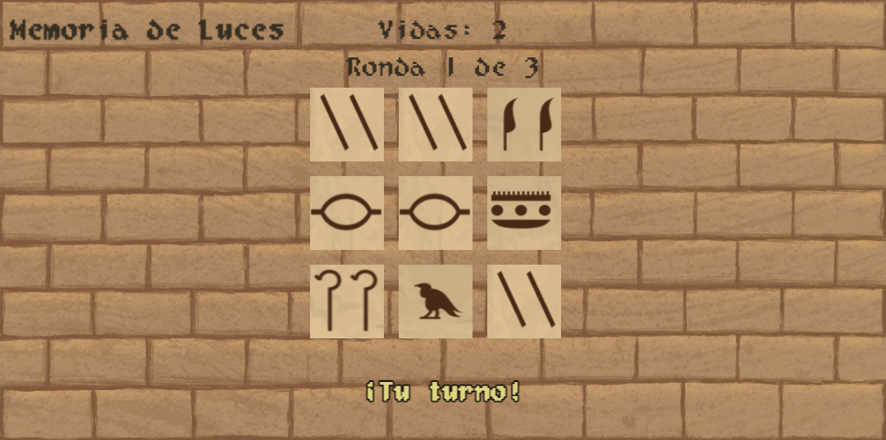
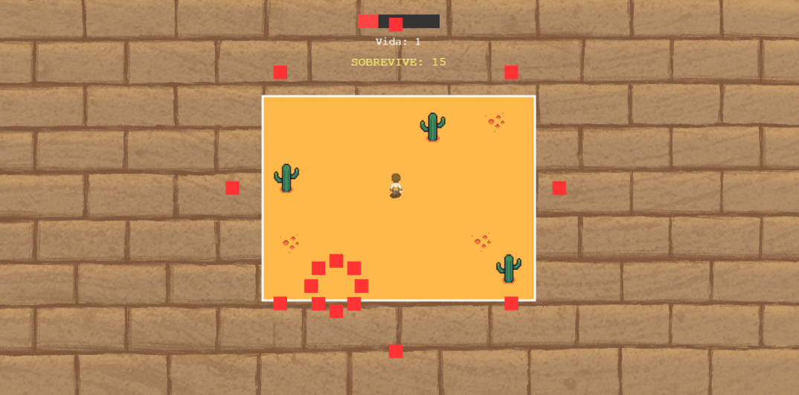
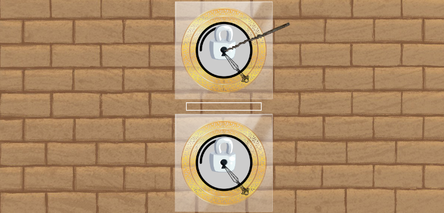
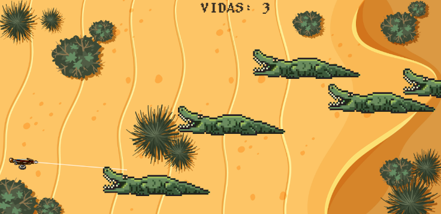

# 𓀙 Wally like an egyptian 𓀙

> ⚠️ **Importante:** Este proyecto es un trabajo universitario para la asignatura de Programación de videojuegos en lenguajes interpretados impartida en la Universidad Complutense de Madrid en el curso 25-26.

# **Prólogo**

* Información del Estudio  
* Juego  
  	Nombre del juego  
  	Género  
  	Público objetivo  
  	Cartas a utilizar  
  	Objetivo y mecánicas  
  	Estilo visual, lore y narrativa  
  	Juegos inspirados  
* Redes sociales  
* Repositorio de Github  
    
    
    
  

## 🎮 Estudio

**Nombre del estudio:** Cat-astrophic Games  
**Miembros:** David Palacios, Blanca Navajas, Ariadna Alicia Ruiz, Juan Sánchez

---

## ✨ Juego

### Nombre del juego
***Wally like an Egyptian.***

### Género
 - Acción y aventura: Explorar y avanzar completando minijuegos.
 - Puzzle: Resolver textos cifrados y minijuegos que requieren lógica y reflejos.

### Público objetivo
- PEGI: +12  
- Público joven, jugadores que disfruten de aventura, minijuegos y narrativa misteriosa.  
- Sin violencia ni escenas +18.

### 🃏 Cartas a utilizar

| Tipo | Nombre | Código |
|------|--------|-------|
| Objeto | Café | P25 |
| Ambientación | Egipto | A12 |
| Mecánica | Pokémon | M31 |
| Mecánica | Pócimas y brebajes | M32 |

---

### 🏆 Objetivo del juego
El jugador, como camarero que lleva su café, debe encontrar a **Wally** dentro de una pirámide del antiguo Egipto.  
Para lograrlo, debe **descifrar jeroglíficos** y desbloquear pistas hasta encontrarlo.

---

### ⚙️ Mecánicas

#### Progresión
- Desbloqueo de jeroglificos que descifran la nota donde te indica el lugar del boss final.
- Debes recorrer el mapa completo para adquirir todos los jeroglificos.
- Progresion de la dificultad de los minijuegos a lo largo del recorrido.

#### Exploración del laberinto
- Necesidad de recorrer el mapa completo para llegar al final, necesitas 15 jeroglificos para pasar al boss.
- Fomentamos la exploracion con la existencia de una sala oculta que te permita ganar varios jeroglificos.
- Obstaculos en el mapa para complicar el movimineto.

#### Minijuegos adaptativos
- Dificultad que escala según el progreso.

#### Mecánica narrativa
- Bitácora, que registra los jeroglíficos encontrados. Esta se abre pulsando una tecla.
- Nota de Wally, contiene una pista para llegar al final y completar el juego, esta nota fue dejada por Wally y hay que descifrarla.
---

### 📋 Minijuegos
- Precisión del escriba: Barra con un escarabajo sagrado con movimiento lateral, el objetivo es detener el escarabajo encima de la gema. La dificultad aumenta disminuyendo los intentos y aumentando la velocidad del movimiento del escarabajo.
- Cazador de Reptiles: Apuntar utilizando las flechas (izq/der) y disparar a los cocodrillos que aparecen a la derecha de la pantalla y se mueven hacia la izquierda. El objetivo es que ningun cocodrilo consiga cruzar la parte derecha de la pantalla. La velocidad aumenta disminuyendo la vidas, es decir la cantidad de cocodrilos que pueden llegar al final, aumentando la cantidad de cocodrilos y aumentando el tiempo de recarga.
- Cerrajero ancestral: El objetivo es abrir las dos cerraduras, para e 
- Furia del desierto: Evitar proyectiles, contine  dos fases, la primera fase lanza dagas de forma lateral desde la derecha y la izquierda,

| Furia del desierto | Evitar proyectiles | Control con flechas; 3 vidas; sobrevivir un tiempo determinado mientras proyectiles se dirigen hacia ti, cada vez más rápido y con comportamientos aleatorios. |
| Memoria del templo | Memoria visual | Repetir secuencias de luces en cuadrícula 3x3; vidas limitadas; dificultad progresiva. |
| Cerrajero ancestral | Precisión | Abrir un candado interactuando cuidadosamente con una ganzúa. |
| Cazador de Reptiles | Apuntar y disparar | Apuntar y disparar a cocodrilos que aparecen antes de que lleguen a tu posición. |
| Buscando a Luigi | Boss final | Una combinación de los juegos anteriores que permiten al jugador acceder a la zona final. |

---

### 📜 Sistema de Jeroglíficos

Los jeroglíficos representan **símbolos antiguos equivalentes a las letras del abecedario latino**.   
Para reflejar su valor histórico y simbólico, se agrupan en **tres niveles de rareza**, denominados **Tiers**.

| Tier | Nombre | Letras | Descripción |
|------|--------|--------|-------------|
| I | Comunes (“Símbolos del Pueblo”) | A, E, I, O, U, S, N, T, L, R, M | Simples y frecuentes en los textos antiguos, representan el conocimiento básico del idioma sagrado. Obtenibles en minijuegos iniciales. |
| II | Inusuales (“Símbolos de los Escribas”) | C, D, G, H, P, B, F, V, Y | Más complejos, aparecen en textos más elaborados, usados por escribas o sacerdotes en rituales o registros ceremoniales. Aparecen en minijuegos intermedios ya que simbolizan simbolizan la erudición y el dominio del lenguaje. |
| III | Legendarios (“Símbolos del Sol”) | K, Q, W, X, Z, J | Raros y poderosos, empleados solo en textos sagrados o con propósitos mágicos. Representan el conocimiento oculto de los dioses y el poder ancestral de la palabra. Obtenibles solo en minijuegos difíciles o perfectos. |

---

### 🎨 Estilo visual y narrativa

#### Estilo gráfico

Wally like an egyptian combina una mezcla de elementos hechos a mano como los fondos, menús y botones junto con un entorno de pixel art en vista top-down con estilo del antiguo egipto, usando paletas de colores en tonos arena, dorados y marrones. 

#### Lore

Mariano, un barista de la cafetería de la pirámide más tenebrosa de Egipto termina de hacer el último café del día. Cansado y con ganas de irse a casa, lee en voz alta el nombre del cliente para que recoja su bebida y así empezar a limpiar y cerrar. Cuando levantó la cabeza, no vio a nadie.

“¡¿Wally?\!” Insistió. Nada. 

“Menos mal que no he cerrado la bolsa de basura” pensó Mariano. Se disponía a tirar el café sin dueño cuando de repente escuchó una voz: “¡QUIETO!”.

Miró hacia atrás pensando en lo intenso que parecía este tal Wally respecto a un simple café corto, pero no vio a nadie. “Seguro que será una bromita de mis compañeros otra vez, saben que me da miedo cuando me toca hacer el cierre solo a estas horas”, pensó. Se volvió para tirar el café lo más rápido posible y salir pitando cuando volvió a escuchar la misma voz: “¡QUE NO ME TIRES\! Soy yo, el café corto.”

Mariano se quedó mirando al café. Sabía que estaba cansado, pero no tanto como para tener alucinaciones. Decidió contestarle al café, porque ante todo, era un señor educado.

“Te tengo que tirar, café. Tengo que cerrar e irme a casa. Si no voy a quedarme encerrado aquí toda la noche.”

“¿Seguro?” Dijo el café. “Sí”, respondió Mariano. “¿Pero seguro de verdad? Mírame. Hago burbujitas” insistió el café corto. Había algo en este café que le hacía quedarse mirando hipnotizado. Era verdad que tenía burbujas. ¿Le había salido alguna vez un café con burbujas? Qué extraño, ¿no?

“Mariano, escucha con atención. Estás hipnotizado.” dijo el café corto. “He tenido que hacer una pausa espacio-temporal para contarte esto antes de que arruines tu vida. Este tal Wally es el crítico de cafeterías más importante del mundo. DEBES buscarle y entregarme a tiempo antes de que te destruya socialmente y no te vuelvan a contratar nunca más. Aprovecha ahora que el tiempo sólo transcurre para ti y para mí, Wally nunca se dará cuenta. Será nuestro secreto.”

Mariano miró fijamente al café corto. Luego miró el reloj de pared. Efectivamente las manecillas se habían parado. El café tenía que llevar la razón. ¿Cómo iba a mentirle? Una criatura tan sabia…

“Café, lo molas todo.” dijo Mariano. “Hagamos esto”.

¿Seremos capaces de entregar el café a tiempo? Eso es lo que los jugadores tendrán que descubrir en *Wally like an Egyptian*.

#### Bocetos / Screenshots

1. **Pantalla de inicio**  
   
2. **Escena de introducción**
   
3. **Exploración del laberinto**  
   
4. **Diccionario de jeroglíficos**  
   
5. **Minijuego: Precisión del escriba**  
   
6. **Minijuego: Memoria del templo**  
   
7. **Minijuego: Furia del desierto**  
   
8. **Minijuego: Cerrajero ancestral**
   
9. **Minijuego: Cazador de reptiles**
   

---

### 🕹️ Juegos inspirados
- **Pokémon**: Exploración y captura de símbolos.  
- **Cooking Mama**: Minijuegos sencillos y adaptativos.  
- **Undertale**: Exploración y encuentros narrativos.

---

### 📱 Redes sociales
- Instagram:  [@cat\_astrophicgames](https://www.instagram.com/cat_astrophicgames/)
- Twitter/X:  [@cat\_astrophicgames](https://x.com/cat_astrophicos)

---

### 💻 Repositorio de GitHub y página web
[Cat-astrophic Games](https://github.com/ariadnarc/PVLI_G13)
[Página web](https://ariadnarc.github.io/PVLI_G13/)
