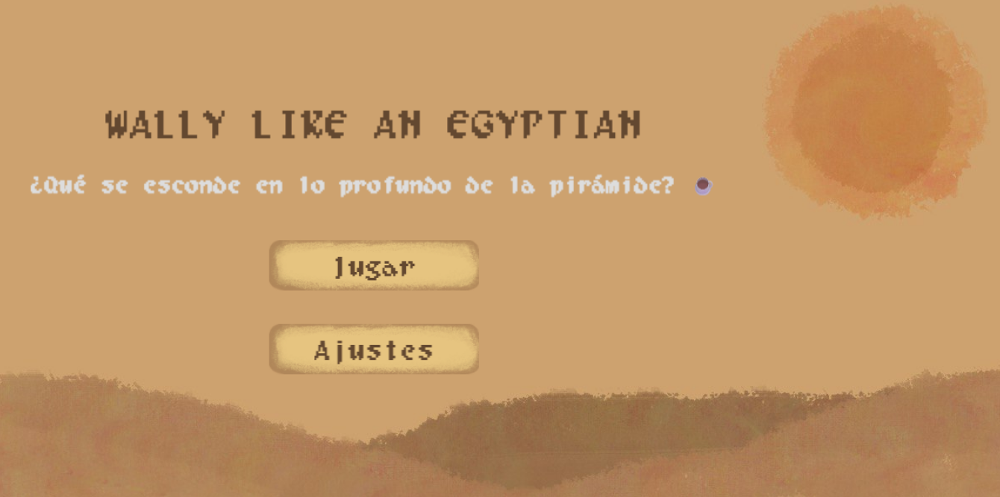

# 𓀙 Wally like an egyptian 𓀙

# **Prólogo**

* Información del Estudio  
* Juego  
  	Nombre del juego  
  	Género  
  	Público objetivo  
  	Cartas a utilizar  
  	Objetivo y mecánicas  
  	Estilo narrativo, lore y narrativa  
  	Juegos inspirados  
* Redes sociales  
* Repositorio de Github  
    
    
    
  

## 🎮 Estudio

**Nombre del estudio:** Cat-astrophic Games  
**Miembros:** David Palacios, Blanca Navajas, Ariadna Alicia Ruiz, Juan Sánchez

---

## ✨ Juego

### Nombre del juego
***Wally like an Egyptian.***

### Género
 - Acción y aventura: Explorar y avanzar completando minijuegos.
 - Puzzle: Resolver textos cifrados y minijuegos que requieren lógica y reflejos.

### Público objetivo
- PEGI: +12  
- Público joven, jugadores que disfruten de aventura, minijuegos y narrativa misteriosa.  
- Sin violencia ni escenas +18.

### 🃏 Cartas a utilizar

| Tipo | Nombre | Código |
|------|--------|-------|
| Objeto | Café | P25 |
| Ambientación | Egipto | A12 |
| Mecánica | Pokémon | M31 |
| Mecánica | Pócimas y brebajes | M32 |

---

### 🏆 Objetivo del juego
El jugador, como camarero que lleva su café, debe encontrar a **Wally** dentro de una pirámide del antiguo Egipto.  
Para lograrlo, debe **descifrar jeroglíficos** y desbloquear pistas hasta encontrarlo.

---

### ⚙️ Mecánicas

#### Progresión
- Desbloqueo de recompensas para jugar minijuegos más complejos.  
- Colección de jeroglíficos que sirven de pista al vencer minijuegos.

#### Exploración del laberinto
- Mapa que se revela gradualmente.  
- Puertas o caminos que se abren tras completar minijuegos.  
- Laberinto con zonas interactivas y objetos movibles.

#### Minijuegos adaptativos
- Dificultad que escala según el progreso.  
- Bonificaciones por completar minijuegos de forma perfecta (mejores jeroglíficos según tier).

---

### 📋 Lista de minijuegos

  ***Barra:*** Juego de exactitud y reflejos. Una barra con un círculo en movimiento lateral continuo con una franja de parada. Objetivo dejar el círculo en la franja. La dificultad crece disminuyendo el tamaño de la franja y aumentando la velocidad del círculo.   
  ***Esquivar:*** El jugador se enfrenta a un reto de reflejos y precisión dentro de un área cerrada. Su objetivo es sobrevivir durante un tiempo limitado mientras evita una lluvia constante de proyectiles que se dirigen hacia él desde todas las direcciones. Este minijuego pone a prueba la agilidad del jugador y su capacidad para mantener el control bajo presión.  
  Mecánicas principales:  
* El jugador controla un pequeño rectángulo azul que puede moverse libremente dentro de un área delimitada.

* El movimiento se realiza mediante las teclas de dirección (flechas) del teclado.

* A intervalos regulares, se generan proyectiles (rectángulos naranjas) fuera del área de juego.

* Cada proyectil se lanza en dirección al jugador, con velocidad y frecuencia crecientes a medida que avanza el tiempo.

* Los proyectiles pueden tener comportamientos aleatorios:

  * Algunos rebotan contra los bordes del área.

  * Otros pueden rotar mientras se desplazan.

  Condiciones de victoria y derrota:

* El jugador gana si logra sobrevivir durante todo el tiempo establecido (3 segundos en la versión actual).

* El jugador cuenta con 3 puntos de vida.

* Cada impacto de un proyectil reduce una vida.

* Si las vidas llegan a 0 antes de que termine el tiempo, el jugador pierde.

* Al ganar, se lanza la escena de VictoriaUI.

* Al perder, el minijuego se reinicia automáticamente tras unos segundos.

  Elementos visuales y de interfaz:  
* El área de juego está delimitada por un marco blanco sobre fondo oscuro.

* Se muestra en pantalla una barra de vida roja con su fondo gris y el texto “Vida: X”.

* También se visualiza un temporizador que indica el tiempo restante para sobrevivir.

* Los proyectiles tienen distintos tamaños y direcciones, aportando variedad visual y dificultad progresiva.  
  ***Luces:*** El jugador participa en un desafío de memoria visual ambientado en una cuadrícula de jeroglíficos antiguos. El objetivo es observar y repetir correctamente una secuencia de símbolos que se iluminan temporalmente. A medida que avanzan las rondas, la complejidad de las secuencias aumenta, poniendo a prueba la concentración y la capacidad de retención del jugador.  
  **Mecánicas principales:**  
* El tablero está compuesto por una cuadrícula de **3x3 casillas**, cada una representada por una imagen de un jeroglífico.

* En cada ronda, el juego muestra una **secuencia aleatoria de luces** (resaltando casillas en orden).

* El jugador debe **repetir la secuencia exacta** tocando las casillas correspondientes en el mismo orden.

* Si el jugador falla en algún paso, **pierde una vida**.

* El jugador cuenta con **2 vidas** en total.

* Si se falla una ronda pero aún quedan vidas, se repite una nueva secuencia con el mismo número de pasos.

* El número de luces por ronda es progresivo:

  * **Ronda 1:** 3 luces

  * **Ronda 2:** 4 luces

  * **Ronda 3:** 5 luces

  **Condiciones de victoria y derrota:**

* El jugador **gana** al completar correctamente las tres rondas.

* El jugador **pierde** si agota las dos vidas antes de finalizar la tercera ronda.

* En caso de derrota, el jugador es devuelto a la escena principal del mapa.  
  **Elementos visuales y de interacción:**  
* Cada casilla representa un jeroglífico con fondo blanco.

* El parpadeo de las casillas se muestra mediante un **efecto de brillo o cambio de transparencia**.

* La interfaz muestra en todo momento el **número de vidas restantes** y la **ronda actual**.

* El jugador interactúa **con el ratón o pantalla táctil**, seleccionando las casillas en orden.  
  ***Balón y portero:*** Juego de precisión. Un “portero” se mueve de manera lateral intentando defender una “portería”. Objetivo introducir un balón en el hueco donde no esté el “portero”, apuntando y dando suficiente potencia. La dificultad crece aumentando la velocidad del “portero”.

  Mecánicas **narrativas**:  
* Bitácora que registra pistas encontradas. Esta se abre pulsando una tecla.

  Mecánicas **Jefe final**:

* Combinación de todos los tipos de minijuegos enfrentados.  
* Fases que cambian según las pistas recolectadas.	

### 📜 Sistema de Jeroglíficos

Los jeroglíficos representan **símbolos antiguos equivalentes a las letras del abecedario latino**.   
Para reflejar su valor histórico y simbólico, se agrupan en **tres niveles de rareza**, denominados **Tiers**.

| Tier | Nombre | Letras | Descripción |
|------|--------|--------|-------------|
| I | Comunes (“Símbolos del Pueblo”) | A, E, I, O, U, S, N, T, L, R, M | Simples y frecuentes en los textos antiguos, representan el conocimiento básico del idioma sagrado. Obtenibles en minijuegos iniciales. |
| II | Inusuales (“Símbolos de los Escribas”) | C, D, G, H, P, B, F, V, Y | Más complejos, aparecen en textos más elaborados, usados por escribas o sacerdotes en rituales o registros ceremoniales. Aparecen en minijuegos intermedios ya que simbolizan simbolizan la erudición y el dominio del lenguaje. |
| III | Legendarios (“Símbolos del Sol”) | K, Q, W, X, Z, J | Raros y poderosos, empleados solo en textos sagrados o con propósitos mágicos. Representan el conocimiento oculto de los dioses y el poder ancestral de la palabra. Obtenibles solo en minijuegos difíciles o perfectos. |

---

### 🎨 Estilo visual y narrativa

#### Estilo gráfico

Wally like an egyptian combina una mezcla de elementos hechos a mano como los fondos, menús y botones junto con un entorno de pixel art en vista top-down con estilo del antiguo egipto, usando paletas de colores en tonos arena, dorados y marrones. 

#### Lore

Mariano, un barista de la cafetería de la pirámide más tenebrosa de Egipto termina de hacer el último café del día. Cansado y con ganas de irse a casa, lee en voz alta el nombre del cliente para que recoja su bebida y así empezar a limpiar y cerrar. Cuando levantó la cabeza, no vio a nadie.

“¡¿Wally?\!” Insistió. Nada. 

“Menos mal que no he cerrado la bolsa de basura” pensó Mariano. Se disponía a tirar el café sin dueño cuando de repente escuchó una voz: “¡QUIETO!”.

Miró hacia atrás pensando en lo intenso que parecía este tal Wally respecto a un simple café corto, pero no vio a nadie. “Seguro que será una bromita de mis compañeros otra vez, saben que me da miedo cuando me toca hacer el cierre solo a estas horas”, pensó. Se volvió para tirar el café lo más rápido posible y salir pitando cuando volvió a escuchar la misma voz: “¡QUE NO ME TIRES\! Soy yo, el café corto.”

Mariano se quedó mirando al café. Sabía que estaba cansado, pero no tanto como para tener alucinaciones. Decidió contestarle al café, porque ante todo, era un señor educado.

“Te tengo que tirar, café. Tengo que cerrar e irme a casa. Si no voy a quedarme encerrado aquí toda la noche.”

“¿Seguro?” Dijo el café. “Sí”, respondió Mariano. “¿Pero seguro de verdad? Mírame. Hago burbujitas” insistió el café corto. Había algo en este café que le hacía quedarse mirando hipnotizado. Era verdad que tenía burbujas. ¿Le había salido alguna vez un café con burbujas? Qué extraño, ¿no?

“Mariano, escucha con atención. Estás hipnotizado.” dijo el café corto. “He tenido que hacer una pausa espacio-temporal para contarte esto antes de que arruines tu vida. Este tal Wally es el crítico de cafeterías más importante del mundo. DEBES buscarle y entregarme a tiempo antes de que te destruya socialmente y no te vuelvan a contratar nunca más. Aprovecha ahora que el tiempo sólo transcurre para ti y para mí, Wally nunca se dará cuenta. Será nuestro secreto.”

Mariano miró fijamente al café corto. Luego miró el reloj de pared. Efectivamente las manecillas se habían parado. El café tenía que llevar la razón. ¿Cómo iba a mentirle? Una criatura tan sabia…

“Café, lo molas todo.” dijo Mariano. “Hagamos esto”.

¿Seremos capaces de entregar el café a tiempo? Eso es lo que los jugadores tendrán que descubrir en *Wally like an Egyptian*.

#### Bocetos / Screenshots

1. **Pantalla de inicio**  
   
2. **Exploración del laberinto**  
   
3. **Diccionario de jeroglíficos**  
   
4. **Pista / inscripción**  
   
5. **Encontrar a Wally**  
   
6. **Minijuego: Barra**  
   
7. **Minijuego: Luces**  
   
8. **Minijuego: Portero**  
   

---

### 🕹️ Juegos inspirados
- **Pokémon**: Exploración y captura de símbolos.  
- **Cooking Mama**: Minijuegos sencillos y adaptativos.  
- **Undertale**: Exploración y encuentros narrativos.

---

### 📱 Redes sociales
- Instagram:  [@cat\_astrophicgames](https://www.instagram.com/cat_astrophicgames/)
- Twitter/X:  [@cat\_astrophicgames](https://x.com/cat_astrophicos)

---

### 💻 Repositorio de GitHub
[Cat-astrophic Games](https://github.com/ariadnarc/PVLI_G13)
